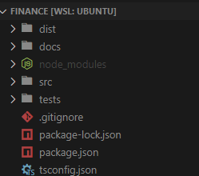

# Architecture of this software.

Here will be explained all the functions of this program.
It can take a while to document all of it, but that's the idea.

---

**How it will be documented?**

I'll pass at all folders of this program and document every single file, I will explain what is calling what, and how do it works together. The point here is to make it clear to understand. I'll also provide a diagram of the structure soon...

---

## Root Folder

Here we have all our files:

